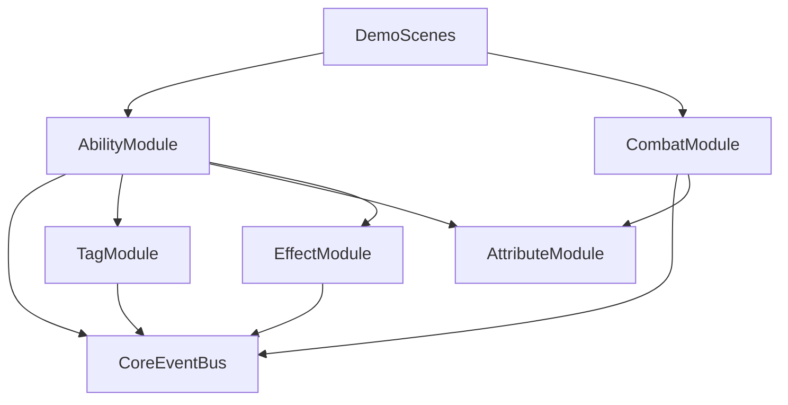

# EW Framework 架构蓝图（Architecture Blueprint）

## 1) 设计目标

- 模板化：可持续扩展，不绑定单一玩法。
- 展示化：可通过独立 Demo 场景讲清系统价值。
- 低耦合：模块通过事件与清晰契约通信，减少硬引用。

## 2) 目录蓝图（目标态）

- `Assets/EW_Framework/Core/`
  - 公共基建：EventBus、基础接口、通用运行时契约
- `Assets/EW_Framework/Modules/`
  - 领域模块：AbilitySystem、Combat、Tag、Attribute、Effect
- `Assets/EW_Framework/Utils/`
  - 通用工具：扩展方法、序列化辅助、调试小工具
- `Assets/EW_Framework/Demo/`
  - 展示内容：Demo 场景、演示预制体、演示配置资产
- `Assets/EW_Framework/Documentation/`（可选）
  - 模块规格、设计决策记录、演示脚本

## 3) 依赖方向规则（必须遵守）

## 3.1 单向依赖

- `Demo -> Modules -> Core`
- `Utils` 可被 `Core/Modules/Demo` 使用，但 `Utils` 不依赖 `Demo`。
- 禁止 `Core` 依赖 `Modules`（避免基建层被业务污染）。

## 3.2 通信原则

- 跨模块通信优先使用：
  1) 抽象接口（编译期契约）
  2) Event Channel（运行期解耦）
- 不允许跨模块直接访问“内部状态对象”，只能通过公开 API 或事件。

## 4) 领域分层（逻辑视图）

## 5) 模块边界定义

- `Core`：
  - 只提供基础能力，不承载玩法语义。
  - 可长期稳定，变更需高门槛。
- `AbilitySystem`：
  - 技能激活、生命周期、冷却、取消/打断规则。
- `Attribute`：
  - 数值状态与变化广播，避免散落在各模块私有字段。
- `Effect`：
  - 数值或状态影响的载体，包含时效与叠层策略。
- `Tag`：
  - 状态门控与条件表达（如 Required/Blocked）。
- `Combat`：
  - 命中、目标筛选、结算流程编排。
- `Demo`：
  - 只负责“展示与验证”，不新增核心业务规则。

## 6) 命名与组织规范

## 6.1 脚本命名

- 类型后缀建议：
  - `*Definition`（配置）
  - `*Spec`（实体绑定态）
  - `*Runtime` 或 `*Controller`（运行控制）
  - `*ChannelSO`（事件通道）

## 6.2 ScriptableObject 资源命名

- 统一前缀：`EW_`
- 示例：
  - `EW_Ability_Fireball_Def`
  - `EW_Tag_State_Stunned`
  - `EW_Effect_Burn_DoT`

## 6.3 场景命名

- 统一模式：`Demo_<Domain>_<Topic>`
- 示例：
  - `Demo_Ability_Basics`
  - `Demo_Effect_Stacking`
  - `Demo_Combat_Interaction`

## 7) 文档驱动开发流程（后续编码参考）

1. 先补规格文档（职责、状态机、数据流）。
2. 再定义 API 草案与验收标准。
3. 最后进入实现与测试。

该流程保证“语义先一致，代码后落地”，减少返工。

## 8) 反耦合与扩展策略

- 对外暴露“稳定接口 + 数据契约”，内部实现允许替换。
- 每个模块预留 Extension Point（例如条件检查器、目标选择策略）。
- Demo 资源禁止反向依赖生产模块内部实现细节。

## 9) 架构验收清单

- 是否满足单向依赖 `Demo -> Modules -> Core`？
- 是否存在跨模块直接读写内部状态？
- 是否每个模块都有清晰职责与边界？
- 是否命名、目录、场景遵循统一规则？
- 是否文档已能指导开发者开始实现？
