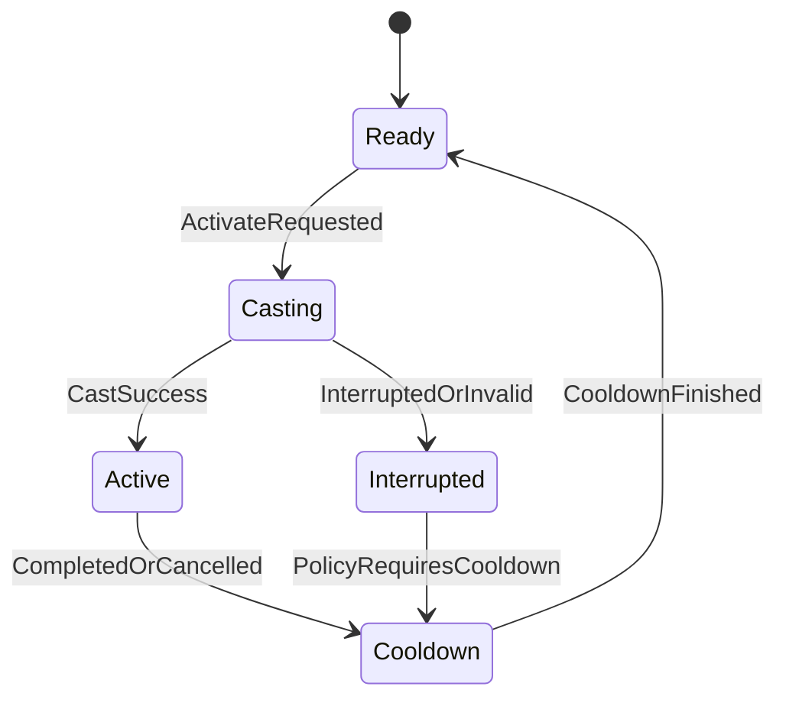
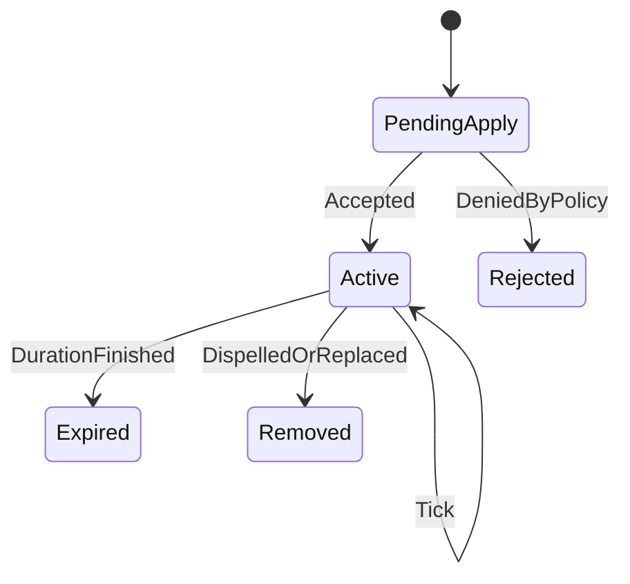

# EW Framework 模块规格说明（Module Specifications）

## 1) 文档目的

本规格用于统一后续实现语义。它定义“模块该做什么、不该做什么”，避免先编码后统一导致的返工。

## 1.1 与当前实现现状的关系（Core 已落地）

- 当前仓库的 `Core` 基建已落地（`SOEventBus`、`ObjectPool`、`TimerSystem`、`SharedVariables`、`StateMachine`、`Singleton` 等）。
- 后续 `Modules`（Ability/Attribute/Effect/Tag/Combat）实现应**优先复用**上述基建：
  - 跨模块可观测与解耦通信：优先使用 `SOEventBus`（Event Channel / SafeEvent）。
  - 周期与延迟驱动：优先使用 `TimerSystem`，避免每个模块自建计时 Update 管线。
  - 高频对象创建：优先使用 `ObjectPool`（含纯 C# 引用池）减少 GC。

---

## 2) Ability 模块规格

## 2.1 职责边界

- 负责能力的激活、持续、结束、取消/打断。
- 负责激活前校验（资源、冷却、Tag 条件）。
- 不负责具体伤害计算和属性存储（交给 Combat / Attribute）。

## 2.2 核心数据模型（概念）

- `AbilityDefinition`
  - 静态配置：冷却规则、消耗规则、触发方式、允许目标类型。
- `AbilitySpec`
  - 与角色绑定的运行态：等级、当前冷却状态、可用性快照。
- `AbilityActivationContext`
  - 一次激活的上下文：施法者、目标、触发源、时间戳。
- `AbilityExecutionResult`
  - 激活结果：成功/失败、失败原因、附带事件。

## 2.3 生命周期

## 2.4 契约要求

- 提供 `CanActivate()` 语义（返回可解释失败原因）。
- 提供 `TryActivate()` 语义（必须幂等处理重复输入）。
- 通过 EventBus 广播状态变化，不直接操作 Demo UI。

---

## 3) Attribute 模块规格

## 3.1 职责边界

- 维护角色属性值（如 HP/MP/Attack/Defense）。
- 提供统一变更入口与变更事件。
- 不负责战斗规则决策（如暴击算法、命中判定）。

## 3.2 核心数据模型（概念）

- `AttributeDefinition`
  - 属性标识、默认值、边界值策略。
- `AttributeValue`
  - Base、Current、Min、Max。
- `AttributeModifier`
  - 加法、乘法、覆盖等修改器描述。
- `AttributeChangeEvent`
  - 变更前后值、来源模块、时间戳。

## 3.3 更新语义

- 写操作仅允许通过统一 API 入口。
- 每次变更必须产生可追踪事件（便于调试与回放）。
- 应保证更新顺序稳定（同帧内确定性顺序）。

---

## 4) Effect 模块规格

## 4.1 职责边界

- 表达并执行对属性或状态的影响。
- 管理持续时间、周期 Tick、叠层规则。
- 不直接处理输入和目标选择策略。

## 4.2 核心数据模型（概念）

- `EffectDefinition`
  - 类型（Instant/Duration/Periodic）、持续时间、Tick 间隔、堆叠策略。
- `EffectSpec`
  - 运行实例：来源、目标、剩余时间、当前层数。
- `EffectApplicationResult`
  - 应用结果：新增、刷新、被拒绝、替换。

## 4.3 生命周期

## 4.4 叠层策略（最小集合）

- `Refresh`：刷新持续时间，不新增实例。
- `Independent`：每次应用独立计时。
- `Replace`：新实例覆盖旧实例。

---

## 5) Tag 模块规格

## 5.1 职责边界

- 提供统一状态标签体系（例如 `State.Stunned`、`Ability.Blocked`）。
- 支持 Required/Blocked 条件查询。
- 不承载具体业务执行逻辑，只负责“状态表达与门控”。

## 5.2 核心数据模型（概念）

- `GameplayTag`
  - 层级名称（如 `State.CC.Stun`）。
- `TagContainer`
  - 当前拥有标签集合。
- `TagQuery`
  - 条件表达式（Any/All/None）。

## 5.3 规则要求

- Tag 名称必须稳定且具可读性。
- 条件查询必须可复用，禁止散落魔法字符串判断。

---

## 6) Combat 模块规格

## 6.1 职责边界

- 负责战斗交互流程编排：目标筛选、命中确认、结算触发。
- 消费 Ability/Effect/Attribute/Tag 的能力，不反向侵入其内部实现。

## 6.2 核心数据模型（概念）

- `CombatContext`
  - 攻击者、目标、技能来源、环境上下文。
- `HitResult`
  - 命中/未命中、命中原因、命中位置（可选）。
- `DamagePayload`
  - 伤害类型、基础值、修正项、来源标识。

## 6.3 结算流程（逻辑）

1. 收集上下文（施法者、候选目标、能力信息）。
2. 执行目标过滤与命中确认。
3. 生成结算载荷并分发给 Attribute/Effect。
4. 广播战斗事件供 Demo/UI 订阅。

---

## 7) 跨模块交互契约

- Ability 触发 Effect，不直接改 Attribute 私有状态。
- Combat 调用 Attribute 公开入口，不越层访问内部字段。
- Tag 仅作为门控和状态表达，保持轻量。
- 所有关键状态变化都应可通过 EventBus 观测。

---

## 8) 错误与边界处理要求

- 所有“激活失败/应用失败/命中失败”都必须有可解释原因。
- 对空目标、无效配置、重复触发等边界输入必须定义行为。
- 失败应可日志化与可视化（供 Demo 调试与后续测试）。
- 建议关键状态变化与失败原因通过 EventBus 可观测（便于 Demo/HUD 订阅与回放）。

---

## 9) 模块规格验收清单

- 每个模块是否定义了“职责 + 非职责”？
- 是否有最小数据模型，且命名一致？
- 生命周期是否明确，状态转移是否可解释？
- 跨模块交互是否遵守依赖方向？
- 边界输入与失败语义是否明确？
